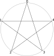

# 多角星的生成

我们都知道，正五角星只有一种画法（除去平凡的正五边形情形），但当点数增大时，画法就有很多了。我感觉当点数增加时，绘制的形状应该会很好看，于是就写了这个网页画着玩。

结论：确实好看。

在下面的输入框中输入 $n_1:m_1, n_2:m_2, \dots$ 格式的数据来绘制图形， 其中 $n_i$ 是边数， $m_i$ 是连接间隔，例如输入 $5:2$ 表示在一个圆上逆时针均匀排布5个顶点中，每个顶点连接其后第2个顶点 $\pmod 5$ ，按顺序 $0 \rightarrow 2 \rightarrow 4 \rightarrow 1 \rightarrow 3 \rightarrow 0$ 绘制出五角星。 $\max_i n_i$ 决定绘制的是几角星，剩余的 $n_i$ 控制子图形的连接间隔。

**示例：**

- `5:2` → 五角星（5个顶点，间隔 $2-1=1$ 个点连接）
- `8:3` → 八角星（8个顶点，间隔 $3-1=2$ 个点连接）
- `6:2` → 六芒星（6个顶点，间隔 $2-1=1$ 个点连接）
- `10:2,5:2` → 由两个五角形组成的十角星（这等价于`10:4`）
- `35:5,7:2` → 由5个7角形组成的35角星（这等价于`35:10`）

$m_i$ 可以替换为 $[m_{i,1},m_{i,2}, \dots]$ 使用不同间隔轮流填充

**示例：**

- `16:[4,2]` → 16角星，但是轮流使用八边形和四边形填充
- `14:[4,6]`→ 14角星，但是使用两个不同的七角星填充

在连接间隔后面加上小数点可以使形状不调用接下来的间隔

**示例：**

- `10:[2,2.],5:2` → 由一个五边形和一个五角形组成的10角星
- `60:[12,12.],5:2` → 由五边形和五角形组成的60角星

让我们把东西组合在一起：

- 试试`32:[4,2,4.,2],8:3,16:3`

[前往绘制](https://chenyu76.github.io/program/draw-n-pointed-star/index.html)

## 题外话

从群的角度可以很容易地理解这个程序在做什么，正 $n$ 边形的对称性构成 $n$ 阶循环群 $G=\mathbb{Z}/n\mathbb{Z}$ :
- 对顶点编号： $V = \{0,1,2,\cdots,n-1\}$ 对应群元素
- 配备的运算：模 $n$ 加法 $a \oplus b = (a + b) \mod n$

连接间隔 $m$ 是群生成元，连接操作定义为群作用： $i \rightarrow i + m \mod n$
- 当 $n,m$ 互素时构成单一轨道（orbit），并且也完全生成了整个循环群。
  - 例如五角星 $5:2$ ：
    - 生成元 $m=2$ 
    - 连接序列： $0 \rightarrow 2 \rightarrow 4 \rightarrow 1 \rightarrow 3 \rightarrow 0$
- 当 $\gcd(n,m) = d > 1$ 时，群作用分解为 $d$ 个轨道，每个轨道是阶为 $n/d$ 的循环子群 $H \cong \mathbb{Z}/(n/d)\mathbb{Z}$ 。此时的形状 $n:m$ 其实就是 $d$ 个 $n/d:m/d$ 的组合。因此我们也可以对这些轨道做递归操作，最后生成复杂图像。
  - 例如10角星 $10:2$
    - 轨道1： $\{0,2,4,6,8\} \to$ 五边形
    - 轨道2： $\{1,3,5,7,9\} \to$ 五边形
    - 此时五边形可以再通过 $5:2$ 生成五角星（这与直接使用 $10:4$ 是相同的）
  

不过如果使用不同间隔 $[m_{i,1},m_{i,2}, \dots]$ 轮流填充就没有什么理论保证了，所以当你使用这个语法时，有时候会能看到有些顶点被重复使用，有些顶点却没被使用。

2025/07/17 
